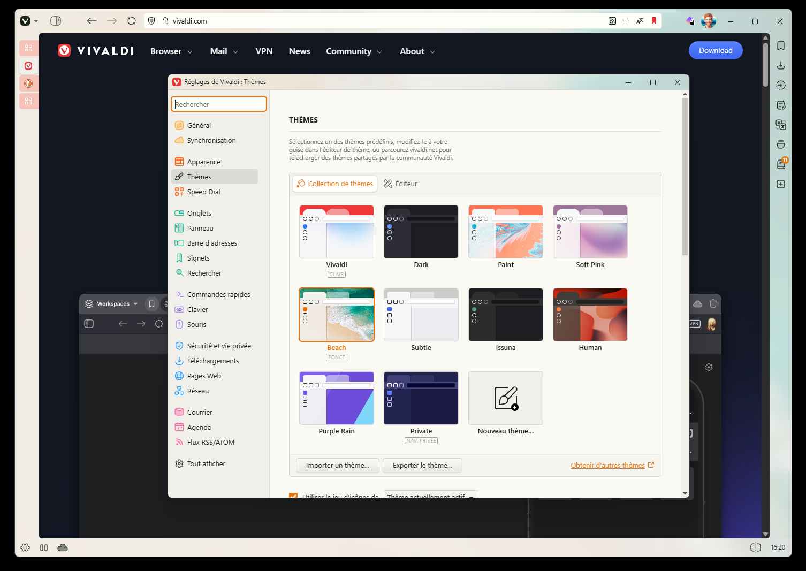
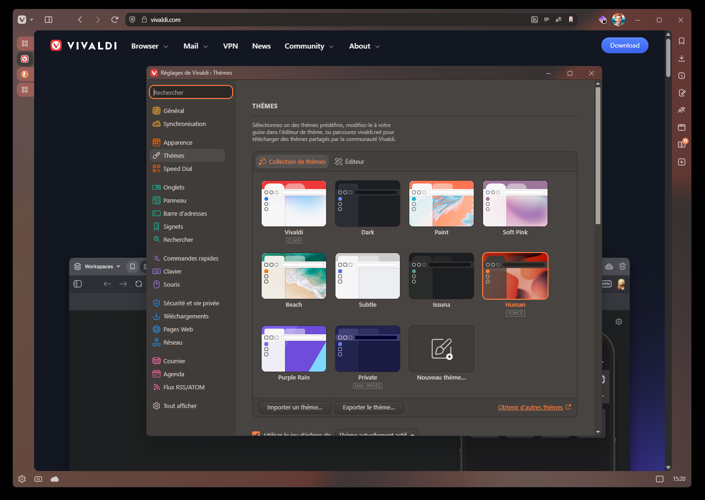
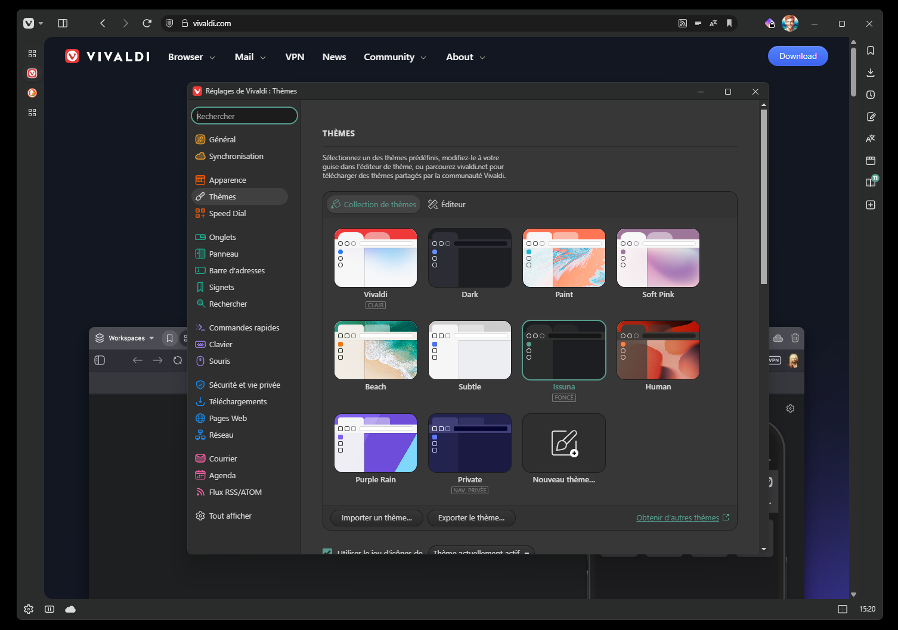

## Description

A simple CSS customization to allow Vivaldi to be more "fluid" and to my own taste (as can be Arc or Zen browsers).

Tab bar is autohiding with a small animation (tabs themselves also animate), and the whole window displays the picture theme with a light blur and transparency effect as per the current theme options (tweak them to make it look even nicer).

> :warning: Please note that it supports only a **vertical tabbar on the left**, and probably has minor issues as of now.

## Screenshots

With the Beach theme

With the Human theme

With the Issuna theme

And a video to have a glance at how it animates

## How to install

Please refer to Vivaldi own documentation ; all you have to do is enable CSS customization through vivaldi:experiments ("Allow CSS modifications") and then head to the corresponding option and pick the folder you put the common.css file in.
Restart your browser, and that's all.